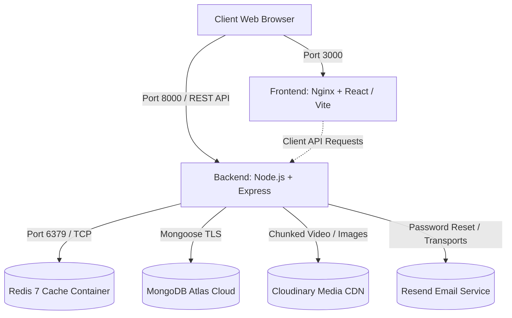

# Streamiify

Streamiify is a modern, high-performance, full-stack video streaming and community sharing platform inspired by YouTube. It offers video publishing with chunked media processing, resilient caching, watch history tracking, real-time analytics, user subscriptions, playlist curation, and token-based authentication.

---

## Architecture

Streamiify is engineered as a modular monorepo separated into `frontend` and `backend` services, fully orchestratable locally using Docker Compose.



- **Frontend**: Single Page Application built with React, Vite, Tailwind CSS, Lucide Icons, and React Query, served production-ready behind an **Nginx** reverse proxy container.
- **Backend**: RESTful API server built on **Node.js (v20)** and **Express 5**, using Express Validator, Multer disk buffering, rate limiting, and HTTP-only cookie JWT auth.
- **Database**: **MongoDB Atlas** (cloud-hosted MongoDB database for persistent users, videos, playlists, comments, and subscriptions).
- **Cache**: **Redis 7** (Docker container with named volume persistence for dashboard analytics, trending rankings, and session lookups).
- **Media Storage**: **Cloudinary** (external CDN handling automatic video chunked uploads and image optimizations).
- **Email Service**: **Resend** (transactional email API for account verification and password reset workflows).
- **Orchestration**: **Docker Compose** managing the multi-container network, healthchecks, and environment configuration.

---

## Requirements

To run Streamiify locally using Docker, you need:

1. **Docker Desktop** installed and running (Windows with WSL2 backend, macOS, or Linux).
2. **MongoDB Atlas** account with a cluster created and connection URI.
3. **Cloudinary** account (Cloud Name, API Key, API Secret) for video/thumbnail hosting.
4. **Resend** account (optional for transactional emails in development).
5. **Git** and **Node.js 20+** (if running tests or local scripts outside of Docker).

> **Important Security Notice**: Never commit real database passwords, JWT secrets, or API keys to GitHub.

---

## Environment Setup

1. **Clone the repository:**
   ```bash
   git clone https://github.com/your-username/streamiify.git
   cd streamiify
   ```

2. **Configure Backend Docker Environment:**
   Copy the backend environment template to create your local Docker environment file:
   ```bash
   cp backend/.env.example backend/.env.docker
   ```

3. **Fill in your credentials in `backend/.env.docker`:**
   Open `backend/.env.docker` and configure your credentials:
   - `MONGO_URI`: Your MongoDB Atlas connection string (`mongodb+srv://...`)
   - `ACCESS_TOKEN_SECRET` & `REFRESH_TOKEN_SECRET`: Strong random strings (minimum 32 characters)
   - `CLOUDINARY_CLOUD_NAME`, `CLOUDINARY_API_KEY`, `CLOUDINARY_API_SECRET`: From your Cloudinary dashboard
   - `REDIS_URL`: Keep as `redis://streamify-redis:6379` (Docker internal service name)
   - `PORT`: `8000`
   - `CORS_ORIGIN`: `http://localhost:3000`
   - `FRONTEND_URL`: `http://localhost:3000`

> **Note**: `backend/.env.docker` is automatically ignored by Git and will **NEVER** be committed to your repository.

4. **Frontend Environment (Optional):**
   The Docker setup defaults `VITE_API_BASE_URL` to `http://localhost:8000` automatically via build arguments. A template is also available at `frontend/.env.example` if running the Vite dev server locally outside Docker.

---

## Run with Docker

Start all services using Docker Compose:

```bash
docker compose up --build
```
*(Add `-d` to run in detached mode in the background).*

Docker Compose orchestrates three services:
1. **`streamify-redis`**: Redis 7 cache with healthcheck on port `6379`.
2. **`streamify-backend`**: Express API server with automatic healthcheck on port `8000`.
3. **`streamify-frontend`**: Nginx web server hosting the compiled React SPA on port `3000`.

### Verifying Service Endpoints

- **Frontend Application**: [http://localhost:3000](http://localhost:3000)
- **Backend API Server**: [http://localhost:8000](http://localhost:8000)
- **Backend Health Check**: [http://localhost:8000/health](http://localhost:8000/health)
  ```json
  {"success": true, "message": "Server is healthy 🚀"}
  ```
- **Backend Readiness Check**: [http://localhost:8000/ready](http://localhost:8000/ready)
  ```json
  {
    "success": true,
    "status": "READY",
    "dependencies": {
      "mongodb": "connected",
      "redis": "connected"
    }
  }
  ```

---

## Stop Services

To stop running containers:

```bash
docker compose down
```

To stop containers and remove the persistent Redis volume:

```bash
docker compose down -v
```

---

## Development & Deployment Notes

- **Separation of Environments**: The local Docker Compose setup is designed for reproducible local development and testing. Production deployments on cloud providers (e.g., Vercel for frontend, Render for backend) use their respective environment dashboards and are isolated from local Docker configuration.
- **Database Persistence**: Primary application data (users, videos, comments, playlists) lives persistently in MongoDB Atlas and is not destroyed when local containers are brought down.
- **Cache Persistence**: Redis caching uses a named Docker volume (`redis-data`) to persist cached data across container restarts.
- **Production-Style Frontend**: The frontend container uses Nginx Alpine to simulate production serving, using `try_files` for Single Page Application routing.

---

## Large Video Upload Note

- The backend and Multer middleware support video upload buffering up to `MAX_VIDEO_SIZE` (defaulting to 1 GB in configuration).
- The client upload request (`uploadVideoApi`) has its Axios timeout explicitly disabled (`timeout: 0`) so large files are not aborted after standard 15-second API timeouts.
- **Cloud Provider Limit**: The actual maximum video size is also constrained by your external Cloudinary plan:
  - **Cloudinary Free Plan**: Enforces a strict server-side video size limit of **100 MB** (`104,857,600 bytes`). Files larger than 100 MB will be rejected by Cloudinary's API with `File size too large`.
  - **Cloudinary Paid Plans**: Support higher limits corresponding to the plan quota.
